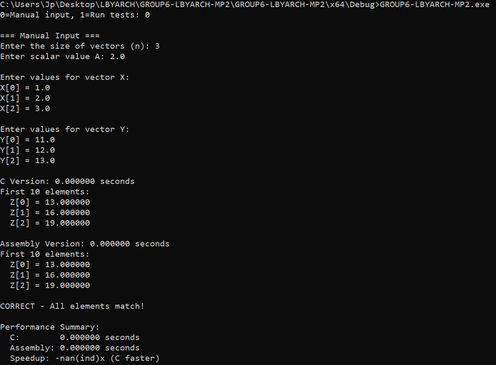

# LBYARCH-MP2
## Group Members
- Gaffud, Jean Luc
- Helbling, John Patrick
## Video Presentation
[Watch with DLSU Account](https://drive.google.com/file/d/11tX2pNPmQntfNpqGq5BGUaIh6LkgBhD4/view)
## Execution Time and Analysis
### Average Execution Time in Seconds (After 30 Runs)
| Vector Size | C Kernel | x86-64 Kernel | Speedup (x86-64 / C)
|--|--|--|--|
| 220 | 0.001733 | 0.000467 | 3.71x |
| 224 | 0.027633 | 0.010633 | 2.60x |
| 228 | 0.441500 | 0.174233 | 2.53x |

[Detailed Raw Output](./resources/average_execution_time_raw.txt)
### Analysis
The `Speedup (x86-64 / C)` column refers to the rate that the x86-64 kernel is faster than the C kernel. From the table, we see that the x86-64 kernel performed significantly faster than the C kernel. The main reason for this is because assembly gives you very direct control over the CPU, so it can run the instructions with less overhead. The compiler also adds extra steps in C to keep the code general and safe, which slows it down relative to the x86-64 kernel. By writing the kernel in assembly, the program can access data and registers more efficiently, leading to faster execution.
## Program Output

